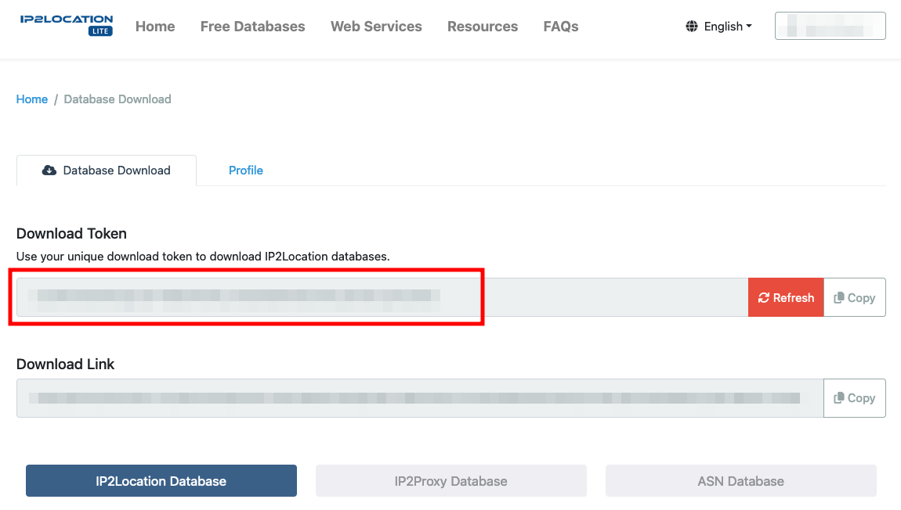

.. include:: ../Includes.txt

.. _admin::

==================
For Administrators
==================

.. _admin-installation:

Installation
============

There are several ways to require and install this extension. We recommend to get this extension via
`composer <https://getcomposer.org/>`__.

.. _admin-installation-composer:

Via Composer
------------

If your TYPO3 instance is running in composer mode, you can simply require the extension by running:

.. code-block:: bash

   composer req leuchtfeuer/locate

.. _admin-installation-extensionManager:

Via Extension Manager
---------------------

Open the extension manager module of your TYPO3 instance and select "Get Extensions" in the select menu above the upload
button. There you can search for `locate` and simply install the extension. Please make sure you are using the latest
version of the extension by updating the extension list before installing the locate extension.

.. _admin-installation-zipFile:

Via ZIP File
------------

You need to download the locate extension from the `TYPO3 Extension Repository <https://extensions.typo3.org/extension/locate/>`__
and upload the zip file to the extension manager of your TYPO3 instance and activate the extension afterwards.

.. important::

   Please make sure to include all TypoScript files.

.. important::

   For an more accurate IPv6 support, your PHP needs to support either :code:`gmp` or :code:`bcmath`. It also has to be compiled
   without the :code:`--disable-ipv6` option. The determination of IP addresses is also possible without these packages, but it
   is less precise.

.. _admin-additionalPackages:

Additional Packages
===================

.. _admin-additionalPackages-staticInfoTables:

Static Info Tables
------------------

If you want to use the geo blocking feature for your pages, you need to to install the
`static info tables <https://extensions.typo3.org/extension/static_info_tables/>`__ extension as well. It is enough to install
just the basic version. Additional country-specific versions are not required by this extension. If you are using a composer setup
you can execute following command:

.. code-block:: bash

   composer req sjbr/static-info-tables

.. _admin-additionalPackages-detectCrawler:

Detect Crawler
--------------

If you want to exclude bots such as the Google search bot from being assigned specific website versions, you must require the
composer package `jaybizzle/crawler-detect <https://github.com/JayBizzle/Crawler-Detect>`__. This feature is only available in
composer setups. If your TYPO3 is not running in composer mode, you have to provide this functions on your own.

.. code-block:: bash

   composer req jaybizzle/crawler-detect

.. _admin-updatingIPDatabase:

Updating the IP Database
========================

We try to update the supplied IP database at least every major update.
After this new version has been installed, you can update your local database via the Extension Manager module in your TYPO3
backend as shown below.

.. figure:: ../Images/update-ip-database.png
   :alt: Update the provided IP database
   :class: with-shadow

   You can update your local IP tables via the Extension Manager module.

You also can update the IP database automatically via console command or scheduler task.

.. _admin-updatingIPDatabase-token:

Get Download-Token from ip2location.com
---------------------------------------

To update the IP database automatically, you have to generate a Download-Token from https://lite.ip2location.com/.
Frist, sign up at https://lite.ip2location.com/sign-up. After creating an account, you can login and access the page
https://lite.ip2location.com/database-download. There you can find the Download-Token.

.. _admin-updatingIPDatabase-command:

Update database via console command
-----------------------------------

You can update the IP database via console command.

.. code-block:: bash

   vendor/bin/typo3 locate:updateIpDatabase TOKEN [static_ip2country_v4|static_ip2country_v6]

Replace "TOKEN" with your own Download-Token and choose a database table you want to update. You can choose between
"static_ip2country_v4" for IPv4 or "static_ip2country_v6" for IPv6.

.. _admin-updatingIPDatabase-scheduler:

Update database via scheduler task
----------------------------------

You also can add a scheduler task to update the IP database periodically. Add a scheduler task in the TYPO3 backend:

Set "token" with your own Download-Token and choose a database "table" you want to update. You can choose between
"static_ip2country_v4" for IPv4 or "static_ip2country_v6" for IPv6.

.. _admin-enablingExtension:

Enabling this Extension
=======================

If you want to activate the :ref:`language assignment <functions-assignLanguage>`, you have to add the following TypoScript
line after you have installed locate and included the TypoScript. This function is disabled by default.

.. code-block:: typoscript

   config.tx_locate = 1

If you do not want to activate the language assignment on every page, you can simply put the activation into a condition.

.. code-block:: typoscript

   [page["uid"] == 1]
       config.tx_locate = 1
   [end]

.. _admin-logging:

Logging
=======

All critical errors will be logged into a dedicated logfile which is located in the TYPO3 log directory (e.g. `var/logs`) and
contains the phrase locate in its name. If you want to increase the loglevel, you must overwrite the log configuration, for
example like this:

.. code-block:: php

   $GLOBALS['TYPO3_CONF_VARS']['LOG']['Leuchtfeuer']['Locate'] = [
       'writerConfiguration' => [
           \TYPO3\CMS\Core\Log\LogLevel::DEBUG => [
               \TYPO3\CMS\Core\Log\Writer\FileWriter::class => [
                   'logFileInfix' => 'locate',
               ],
           ],
       ],
   ];

For further configuration options and more examples take a look at the official TYPO3
`documentation <https://docs.typo3.org/m/typo3/reference-coreapi/master/en-us/ApiOverview/Logging/Configuration/Index.html>`__.
