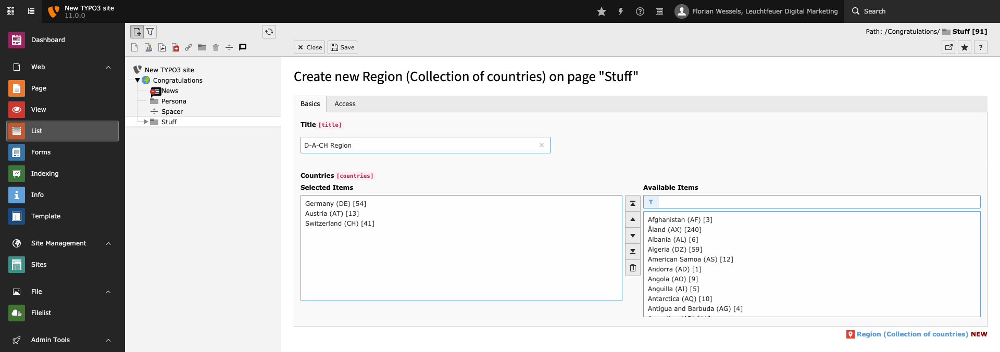
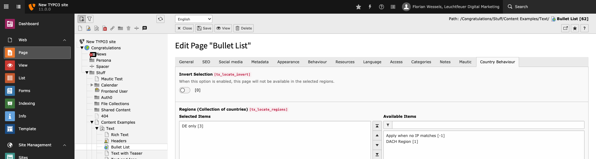

.. include:: ../../Includes.txt

.. _functions-geoBlocking:

============
Geo Blocking
============

You can block pages (and page translations) for access from certain countries.

.. note::

   You need to to install the `static info tables <https://extensions.typo3.org/extension/static_info_tables/>`__ extension to use
   the geo blocking feature.

.. _functions-geoBlocking-regions:

Regions
=======

So that you do not have to select individual countries every time you want to block a group of countries, individual countries
may be combined into regions. You can create this groups as a record in the list module of your TYPO3 backend.

   Each region (collection of countries) can contain multiple countries and has a title.

.. _functions-geoBlocking-assignRegions:

Assign Regions
==============

After you have created the regions you need, you can assign these regions to a page (or a page translation). This web page will
then be available in the defined regions only. The access to the page from all other countries will be restricted and a 451 HTTP
status code will be returned, which you can process e.g. via a site
`error handler <https://docs.typo3.org/m/typo3/reference-coreapi/master/en-us/ApiOverview/SiteHandling/ErrorHandling.html>`__.

   Assign regions to pages.

.. tip::

   You can invert the selection. If you do this, the page will be unavailable in the specified regions.

.. note::

   Not take action if you logged in as backend user or EXT:static_info_tables is not loaded.

.. _functions-geoBlocking-assignRegions-outlier:

Outlier
-------

You can also assign the value "Apply when no IP matches" to the selection. This case occurs when the IP address cannot be
determined or is not stored in the IP database.
